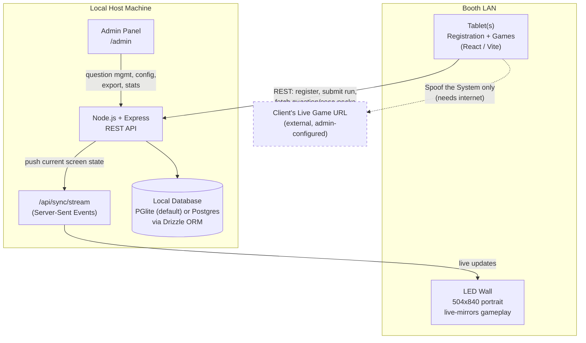

# Bureau Fraud Arena - GFF 2026

This application houses both the interactive games (Experience 1) and the AI Demo Area (Experience 2) for the Bureau booth at GFF 2026.

## Architecture

Single Node.js application, one deployable unit, running entirely on a host machine at the booth. The tablet and the LED wall are both just browsers pointed at that host over the local network — there is no separate LED build.

**Request flow:** the tablet talks to the Express server over REST for everything (registration, fetching a randomized question/case pack, submitting a run, saving in-progress state). The server is DB-first for all game content — an admin edit in `/admin` is live on the next fetch, with zero code deploy. A small bundled dataset (`client/data/*`) is used **only** as an offline fallback if that fetch fails (e.g. the server is still booting), so the booth never goes fully dark, but it can never override what the admin has configured.

**Tablet → LED mirroring:** the LED wall doesn't run its own game logic. The tablet's current screen state is pushed to the server, which fans it out to every connected LED display over a Server-Sent Events stream (`server/routes/sync.ts` / `client/hooks/useSyncStream.ts`). This is why the LED shows live gameplay without ever handling registration data itself.

**Persistence:** `db/index.ts` picks `PGlite` (an embedded, file-backed Postgres-compatible WASM database, `./.pgdata`) when no `DATABASE_URL` is set, or a real Postgres via `pg` when one is. Either way, all registration, question, run, and session data lives on the host machine — nothing leaves the LAN except the one Game 2 redirect.

**Component map**

| Layer | Tech | Responsibility |
|---|---|---|
| `client/` | React 18 + Vite + wouter | Tablet UI: registration, the three games, leaderboard, LED view |
| `server/` | Express 5 | REST API, admin auth, session/score logic, SSE fan-out |
| `db/` | Drizzle ORM + PGlite/Postgres | Schema, migrations, local-first storage |
| `shared/` | Zod + generated client | Typed request/response contracts shared by client and server |

## Fully Offline Deployment

This application is configured for a **fully offline** air-gapped LAN environment. It does not require internet access, with the *sole exception* of Game 2 ("Beat the Deepfake System"), which is a redirect to a live client URL.

### 1. Build & Self-Host
- The event must run on a physical host machine (e.g. a local laptop/server) at the booth.
- Install dependencies: `npm install`
- Build the app: `npm run build`
- Start the server: `npm start`

### 2. Local Network Setup
- Connect the host machine, all iPads, the LED wall controller, and the 4 AI Demo screens to a single local router (LAN).
- Give the host machine a **static IP** (e.g., `192.168.1.10`) or set a DHCP reservation on the router.

### 3. Point Devices at the Local Host
Set each kiosk device to auto-launch the local URLs in kiosk mode:
- **Registration & Games (iPads):** `http://192.168.1.10:3000/join`
- **LED Wall (Live Gameplay):** `http://192.168.1.10:3000/` (or whatever the live view URL is)
- **AI Demo Screen 1 (Vertical - Identity):** `http://192.168.1.10:3000/ai-demo/1`
- **AI Demo Screen 2 (Vertical - Security):** `http://192.168.1.10:3000/ai-demo/2`
- **AI Demo Screen 3 (Vertical - Fraud):** `http://192.168.1.10:3000/ai-demo/3`
- **AI Demo Screen 4 (Horizontal - Monitor):** `http://192.168.1.10:3000/ai-demo/4`

## Admin Panel
Access the host panel at `http://192.168.1.10:3000/admin` to:
- Update the Game 2 redirect link ("Beat the Deepfake System").
- Toggle Global Leaderboard or Waitlist features on/off.
- View live event metrics, leaderboard, and user registration data.
- Download CSV/Excel reports.

## Testing Protocol (Verify Offline Readiness)
Code review is not sufficient proof. Before the event, physically test the air-gap:

1. **Disconnect the internet** (unplug WAN or disable Wi-Fi on the router).
2. Open network devtools on a device and confirm **zero failed/pending requests** to external domains (fonts, images, analytics).
3. E2E Test:
   - Register a new user on a tablet.
   - Play Spot the Fraud and Crack the Fraud Network; verify scores post to the leaderboard correctly without internet.
   - Verify the LED Wall mirrors gameplay.
   - Test Beat the Deepfake System. (This is the *only* piece that should fail or timeout if there's no internet).
   - Attempt a duplicate registration; verify the 409 conflict error displays.
   - Tap through the 4 AI Demo screens and wait for the 45-second inactivity timeout to return them to the video loops.
   - Open the `/admin` panel and ensure settings load successfully.
